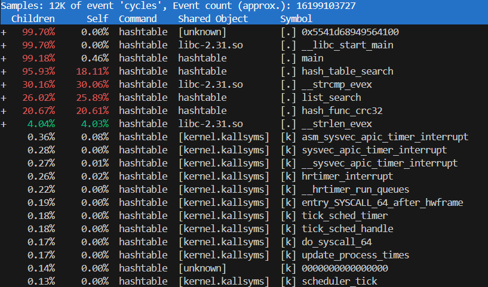
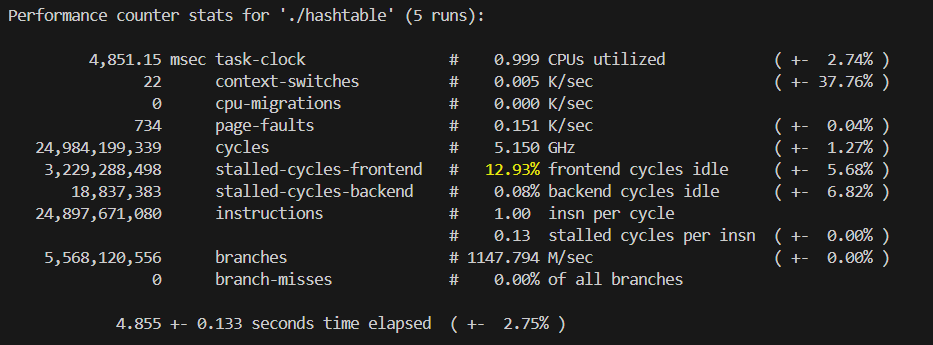
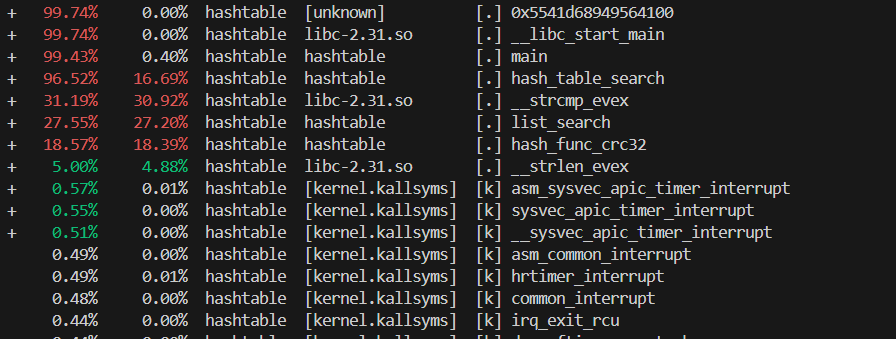
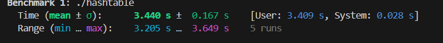
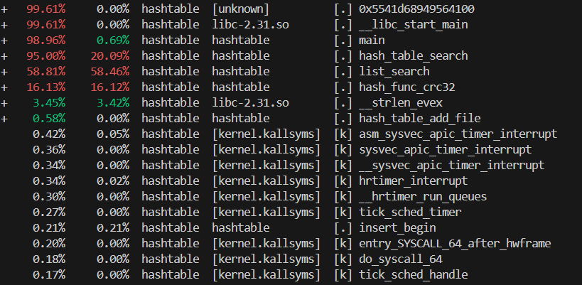
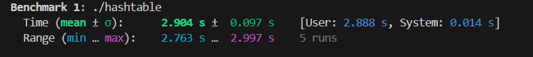
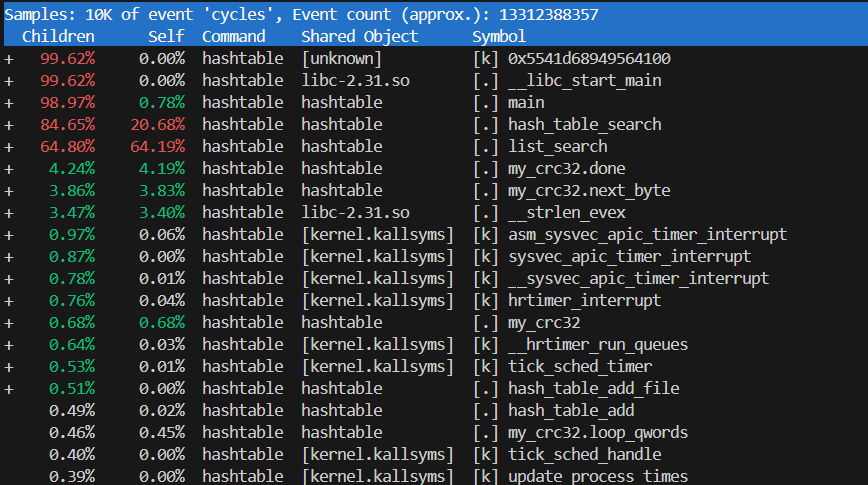
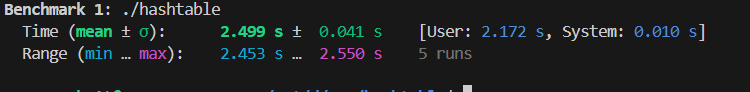
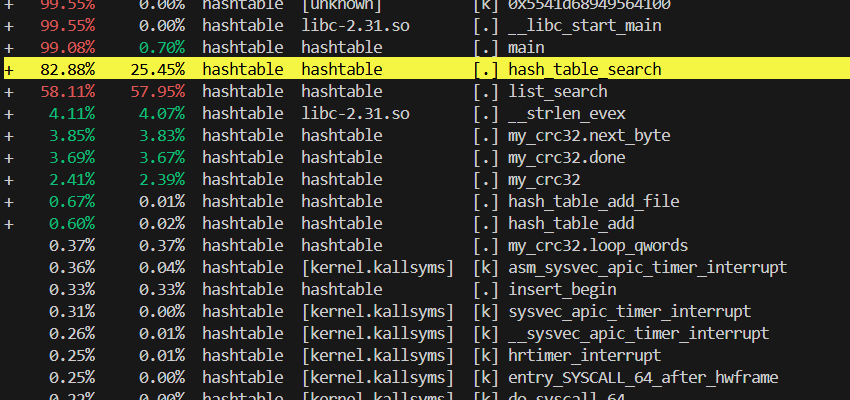

# Отимизация хэш талицы 

## Godbolt rol ror

```asm
hash_func_rol (char const*): (O0)
        push    rbp
        mov     rbp, rsp
        sub     rsp, 32
        mov     qword ptr [rbp - 16], rdi
        mov     rax, qword ptr [rbp - 16]
        movsx   rax, byte ptr [rax]
        mov     qword ptr [rbp - 24], rax
        cmp     qword ptr [rbp - 24], 0
        jne     .LBB0_2
        mov     rax, qword ptr [rbp - 24]
        mov     qword ptr [rbp - 8], rax
        jmp     .LBB0_3
.LBB0_2:
        mov     rax, qword ptr [rbp - 24]
        mov     esi, 3
        movzx   edi, al
        call    rol(unsigned char, int)
        movzx   eax, al
        mov     qword ptr [rbp - 24], rax
        mov     rax, qword ptr [rbp - 24]
        mov     rcx, qword ptr [rbp - 16]
        movsx   rcx, byte ptr [rcx + 1]
        xor     rax, rcx
        mov     qword ptr [rbp - 24], rax
        mov     rax, qword ptr [rbp - 24]
        mov     qword ptr [rbp - 8], rax
.LBB0_3:
        mov     rax, qword ptr [rbp - 8]
        add     rsp, 32
        pop     rbp
        ret
```

```asm
hash_func_ror (char const*): (O0)
        push    rbp
        mov     rbp, rsp
        sub     rsp, 32
        mov     qword ptr [rbp - 16], rdi
        mov     rax, qword ptr [rbp - 16]
        movsx   rax, byte ptr [rax]
        mov     qword ptr [rbp - 24], rax
        cmp     qword ptr [rbp - 24], 0
        jne     .LBB2_2
        mov     rax, qword ptr [rbp - 24]
        mov     qword ptr [rbp - 8], rax
        jmp     .LBB2_3
.LBB2_2:
        mov     rax, qword ptr [rbp - 24]
        mov     esi, 3
        movzx   edi, al
        call    ror(unsigned char, int)
        movzx   eax, al
        mov     qword ptr [rbp - 24], rax
        mov     rax, qword ptr [rbp - 24]
        mov     rcx, qword ptr [rbp - 16]
        movsx   rcx, byte ptr [rcx + 1]
        xor     rax, rcx
        mov     qword ptr [rbp - 24], rax
        mov     rax, qword ptr [rbp - 24]
        mov     qword ptr [rbp - 8], rax
.LBB2_3:
        mov     rax, qword ptr [rbp - 8]
        add     rsp, 32
        pop     rbp
        ret
```

```asm
hash_func_rol (char const*): (O3)
        movzx   eax, byte ptr [rdi]
        test    al, al
        je      .LBB0_1
        rol     al, 3
        movzx   ecx, al
        movsx   rax, byte ptr [rdi + 1]
        xor     rax, rcx
        ret
.LBB0_1:
        xor     eax, eax
        ret
```

```asm
hash_func_ror (char const*): (O3)
        movzx   eax, byte ptr [rdi]
        test    al, al
        je      .LBB2_1
        rol     al, 5
        movzx   ecx, al
        movsx   rax, byte ptr [rdi + 1]
        xor     rax, rcx
        ret
.LBB2_1:
        xor     eax, eax
        ret
```

## Первая версия без оптимизаций 

<div align="center">


### Результат профилирования.

</div>

<br>

<div align="center">


### Время выполнения.

</div>

<br>

## Оптимизации на си

<div align="center">


### Результат профилирования.

</div>

<br>

<div align="center">


### Время выполнения.

</div>

<br>

- Относитеьное ускорение  **29.1%**

## Оптимизация strcmp с помощью векторных инструкций

<div align="center">


### Результат профилирования.

</div>

<br>

<div align="center">


### Время выполнения.

</div>

<br>

- Относитеьное ускорение  **15.7%**

## Переписывание crc32 на ассемблер

<div align="center">


### Результат профилирования.

</div>

<br>

<div align="center">


### Время выполнения.

</div>

<br>

- Относитеьное ускорение  **13.9%**

## Ассемблерная вставка

<div align="center">


### Результат профилирования.

</div>

<br>

<div align="center">


### Время выполнения.

</div>

<br>

- Относитеьное ускорение  **4.2%**

# Резултаты

Полное ускорение 

- Полное ускорение 50%


